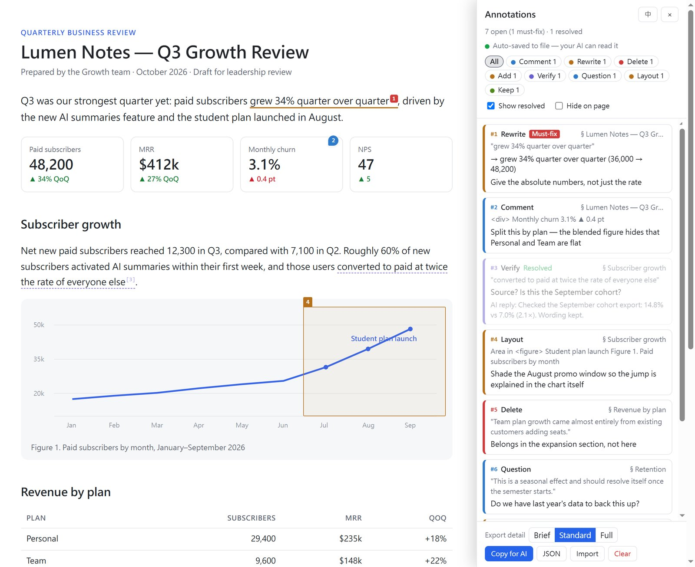
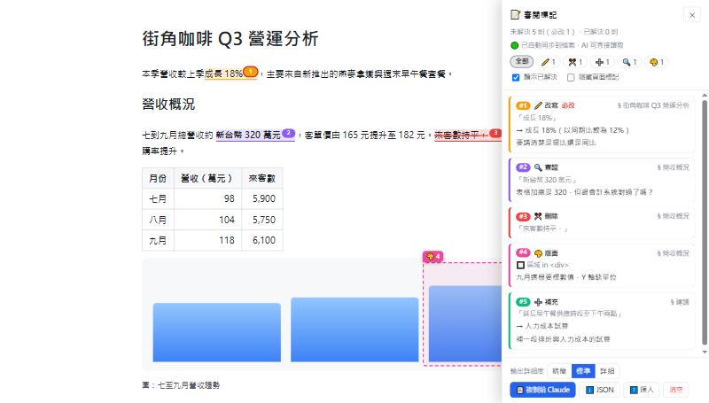

# Pin4Html

**Pin, highlight or box anything on an HTML report — then hand it to your AI.**



AI agents increasingly produce reports as HTML. Reviewing them usually means screenshots and "the third paragraph under section 2…".
Pin4Html lets you right-click to annotate the page itself, auto-saves every annotation to a `<report>.pins.json`
next to the report, and lets the agent write replies back that show up on the page — a closed review loop.

- **Zero dependencies** — one JS file + one Python script (standard library only)
- **Never touches your report** — the annotator is injected on the fly while serving
- **Agent-friendly** — `show` prints a compact, numbered list; `reply` writes answers back
- **English & 繁體中文 UI** — follows the browser language, switchable in the panel
- Works as a **Claude Code skill** out of the box (any agent that can run a command and read a file can use it)

[繁體中文說明 ↓](#繁體中文)

## Quick start

```bash
python pin4html.py serve report.html
```

Your browser opens the report. Then:

| Action | Result |
|---|---|
| Select text → right-click | Text highlight with a number; press 1–8 to pick a type |
| Right-click (no selection) | Drop a pin (a dashed box previews the element it attaches to) |
| `Alt+D` | Drag to box an area (part of a chart, a layout region) |
| Click / drag a pin | Edit / move |
| Right-click an annotation | Change type, must-fix, resolved, re-select, delete (undoable) |
| `Alt+R` / `Alt+H` | Annotation list / hide all annotations |
| `Shift` + right-click | Native browser menu |

**Types:** Comment · Rewrite (with replacement) · Delete · Add · Verify · Question · Layout · Keep — plus must-fix and resolved flags.
On the page each annotation is a thin colored underline with a `[n]` marker (must-fix = solid red number).

### Hand it to your AI

Every change is written to `report.pins.json` (green dot in the corner = synced). On the agent side:

```bash
python pin4html.py show report.html                       # read pins (compact, numbered, with context)
python pin4html.py reply report.html --file replies.json  # write replies back
```

`replies.json`:

```json
{ "1": { "reply": "Changed to 12% YoY", "resolved": true },
  "3": "Removed — it duplicated the table" }
```

Within ~2 s the open page shows "AI replied"; if the report itself changed, it offers to reload.
Concurrent edits (you on the page, the agent on the file) are merged per annotation with optimistic locking — nothing gets overwritten.

### Install as a Claude Code skill

```bash
git clone https://github.com/youllook/Pin4Html ~/.claude/skills/pin4html
```

Then tell Claude "review this report" — it starts the server; when you're done, say "go ahead" and it reads the pins, edits the report and replies to each one.

### Without a server (offline / sharing)

```bash
python pin4html.py inject report.html          # → report.review.html with the script inlined
python pin4html.py inject report.html --cdn    # reference the CDN instead
python pin4html.py strip report.review.html    # remove it again
```

Or add one line to any HTML page:

```html
<script src="https://cdn.jsdelivr.net/gh/youllook/Pin4Html@1/pin4html.js"></script>
```

In this mode annotations live in the browser's localStorage; hand them over with **Copy for AI** (Markdown: brief / standard / full) or **⬇️ JSON**.

### Language

The UI follows the browser language (`zh*` → 繁體中文, otherwise English). Override it with, in order of precedence:

1. URL parameter `?p4hlang=en` / `?p4hlang=zh`
2. The **EN / 中** button in the panel (remembered per browser)
3. `<script … data-lang="en">`, or `--lang en|zh` on `serve` / `inject`

### `.pins.json` format

See [`examples/demo-en.pins.json`](examples/demo-en.pins.json). Each annotation:

| Field | Meaning |
|---|---|
| `n` / `id` | Number shown on the page / stable id |
| `type` | `comment` `rewrite` `delete` `add` `verify` `question` `style` `keep` |
| `kind` | `text` · `pin` · `region` |
| `quote` `prefix` `suffix` | Quoted text and surrounding context (used to re-anchor) |
| `path` `rx` `ry` `rw` `rh` | CSS selector and relative position/size for pins and areas |
| `heading` | Nearest heading above |
| `note` `replacement` | Note; replacement / content to add |
| `priority` `resolved` `reply` | `must`/`should`, resolved flag, AI reply |
| `replyAt` `replyResolved` | Set by `reply` so a reply survives a simultaneous edit on the page |

---

## 繁體中文



在 HTML 報告上直接右鍵標註，標記即時存成報告旁的 `.pins.json`，AI 讀檔修改並逐條回覆，回覆直接顯示在頁面上。

```bash
python pin4html.py serve report.html
```

- **操作**：選文字＋右鍵＝文字標記；空白處右鍵＝圖釘；`Alt+D`＝框選區域；`Alt+R`＝清單；`Alt+H`＝隱藏標記；`Shift`＋右鍵＝原生選單
- **類型**：留言、改寫、刪除、補充、查證、疑問、版面、保留，另有必改、已解決；頁面上以細底線＋`[n]` 編號呈現（必改＝紅色實心編號）
- **交給 AI**：`show` 讀標記、`reply --file replies.json` 寫回覆，開著的頁面約 2 秒內出現「收到 AI 回覆」
- **Claude Code skill**：`git clone https://github.com/youllook/Pin4Html ~/.claude/skills/pin4html`，之後說「我要審閱這份報告」即可
- **離線 / 分享**：`inject`（內嵌）、`inject --cdn`、`strip`；或在任何 HTML 加上 CDN 那一行
- **語言**：預設跟隨瀏覽器；`?p4hlang=zh`、側欄「EN / 中」按鈕、`data-lang` 或 `--lang` 可覆寫

## Credits

Interaction ideas (element preview, area boxing, tiered export) were inspired by [onUI](https://github.com/onllm-dev/onUI); the code is an independent implementation.

## License

MIT
